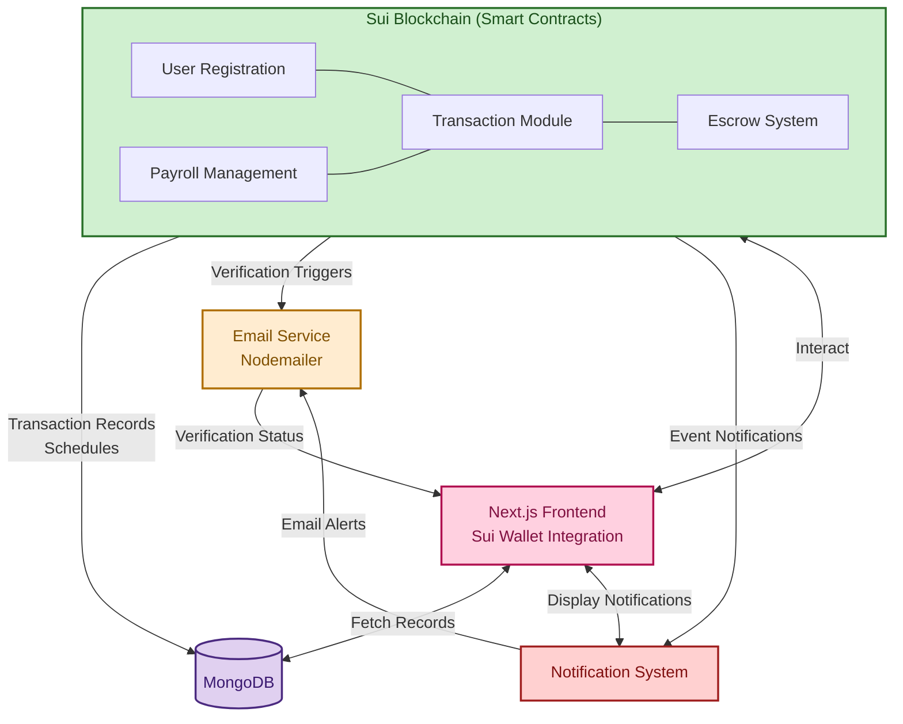

<p align="center">  
  <a href="" rel="noopener">  
      
  </a>  
</p>
<div align="center">

[](https://Secure-Token-Transfer-rho.vercel.app/)
[]()
[](https://github.com/alibaba0010/Secure-Token-Transfer/issues)
[](https://github.com/alibaba0010/Secure-Token-Transfer/pulls)
[](LICENSE.md)

</div>
<h3 align="center">Secure Token Transfer</h3>  
<p align="center">  
  A Next.js application for managing secure token transfers, payments, and financial analytics.  
</p>

---

## 📝 Table of Contents

- [Problem Statement](#problem-statement)
- [Solution Overview](#solution-overview)
- [Features](#features)
- [Tech Stack](#tech-stack)
- [Architecture & Project Structure](#architecture--project-structure)
- [Getting Started](#getting-started)
- [Usage](#usage)
- [Environment Variables](#environment-variables)
- [API Endpoints](#api-endpoints)
- [Contributing](#contributing)
- [Deployment](#deployment)
- [Future Roadmap](#future-roadmap)
- [Authors & Acknowledgments](#authors--acknowledgments)
- [License](#license)

---

## 🧐 Problem Statement

Sending payments on the Sui network often presents usability challenges and security concerns for everyday users. Interacting solely through complex wallet addresses increases the risk of errors, while the lack of integrated, user-friendly escrow mechanisms complicates secure peer-to-peer transfers where trust isn't established. Additionally, recipients may not receive timely notifications about incoming funds, leading to a less convenient and potentially uncertain payment experience for simple transactions.

These issues are magnified for more complex payment scenarios. Managing bulk payments, such as payroll or distributing rewards, becomes a tedious and inefficient manual process. Furthermore, the absence of native tools for scheduling future transactions or easily managing organized lists of payees hinders both individuals and organizations seeking to utilize Sui for regular, planned financial operations, creating significant friction for routine financial management within the ecosystem.

---

## 💡 Solution Overview

Secure Token Transfer is a Next.js–based dashboard and API suite that provides:

- **User System:** Registration with username/email linked to wallet addresses
- **Types:** Direct transfers, escrow payments, bulk transactions, and scheduled payments
- **Multi-Token Support:** Native SUI and USDC token transfers
- **Sponsored Transactions:** Gas-free operations for better user experience
- **Escrow Features:** Email verification, claim/reject options, refund capabilities
- **Payroll Tools:** Contact management, lookup functionality, batch processing
- **Notifications:** Transaction alerts and status updates
- **Smart Contracts:** User registry, transaction processing, escrow management, time-lock modules
- **Security:** Verification codes, transaction signing, access controls.

---

## 🚀 Features

### User Registration

- Create accounts with username and email
- Link wallet addresses to user profiles
- Lookup users by username, email, or wallet address

### Transaction Management

- **Direct Transfers**: Send SUI and USDC tokens directly to recipient wallets
- **Multi-Token Support**:
  - Native SUI token transfers
  - USDC stablecoin integration
  - Automatic token balance tracking
  - Real-time price feeds for token conversion
  - Gas fee optimization for different tokens
  - Token allowance management
- **Sponsored Transactions**:
  - Gas-fee support for new users(wallet address)
  - Sponsored transaction limits and policies
  - Initial SUI token allocation for new wallets
- **Escrow Payments**: Send to contract with verification requirements
- **Bulk Transactions**: Send to multiple recipients at once
- **Scheduled Payments**: Set future date/time for transaction activation

### Escrow System

- Email verification codes sent to recipients
- Claim/reject options for recipients
- Refund capability for senders
- Verification code sharing through sender's preference

### Payroll Management

- Create and manage recipient lists
- Store username, email, wallet address, and payment amounts
- Look up recipient details using any stored information
- Process batch payments to entire payroll groups

### Notifications

- Transaction alerts for recipients
- Escrow claim notifications
- Payment status updates
- Scheduled transaction reminders

---

## 🛠 Tech Stack

- **Blockchain**: Sui Network
- **Smart Contracts**: Sui Move language
- **Token Standards**: SUI native, USDC on Sui
- **Transaction Sponsorship**: Sui sponsored transaction framework
- **Frontend**: Next.js
- **Backend API**: Next.js API routes
- **Database**: MongoDB
- **Email Service**: Nodemailer
- **Blockchain Integration**: Sui SDK
- **Wallet Integration**: Sui Wallet

---

## 🏗 Architecture & Project Structure



```
src/
├── app/                   # Next.js App Router (pages & layouts)
├── components/            # Reusable UI components (Cards, Tables, Modals)
├── contexts/              # React Context providers (Auth, Network)
├── hooks/                 # Custom Hooks (useTransactions, useNotifications)
├── lib/                   # Core business logic & API clients
├── providers/             # App-wide providers (Theme, Toast)
├── types/                 # TypeScript interfaces & types
├── utils/                 # Utility functions (date formatting, error handling)
├── styles/                # Global styles (Tailwind config, globals.css)
└── tests/                 # Unit & integration tests
```

---

## 🏁 Getting Started

### Prerequisites

- Node.js ≥ 18.x
- npm or Yarn

### Installation

```bash
# Clone
git clone https://github.com/alibaba0010/secure-token-transfer.git
cd secure-token-transfer

# Install dependencies
npm install
# or
yarn install

# Create environment file
cp .env.example .env.local
```

---

## ▶️ Usage

```bash
# Start development server
npm run dev
# or
yarn dev
```

Open your browser at [http://localhost:3000](http://localhost:3000).

Lint & format:

```bash
npm run lint
npm run build
```

---

## ⚙️ Environment Variables

Create a `.env.local` file with:

---

## 🤝 Contributing

1. Fork the repo
2. Create a feature branch: `git checkout -b feat/my-feature`
3. Commit changes: `git commit -m "feat: add new feature"`
4. Push branch: `git push origin feat/my-feature`
5. Open a Pull Request

Please read [CONTRIBUTING.md](./CONTRIBUTING.md) for detailed guidelines.

---

## 🚀 Deployment

1. Push to GitHub
2. On Vercel, import the repo
3. Set environment variables in Vercel dashboard
4. Trigger a deploy — Vercel will automatically build & publish

---

## 🔮 Future Roadmap

- ➕ On-chain analytics integrations (The Graph, Dune)
- 💰 Additional token support (BTC, ETH bridges)
- 🤖 Automated compliance & KYC modules
- 📱 Mobile-optimized UI & React Native companion app
- 🪙 Support for additional token standards (ERC-1155, BEP-721)

---

## ✍️ Authors & Acknowledgments

- **Your Name** – [@your-github](https://github.com/your-github)
- **Contributors** – See [contributors](https://github.com/your-org/secure-token-transfer/contributors)

Thanks to the open-source communities and all contributors.

---

## 📜 License

This project is licensed under the **MIT License**. See [LICENSE.md](LICENSE.md) for details.
